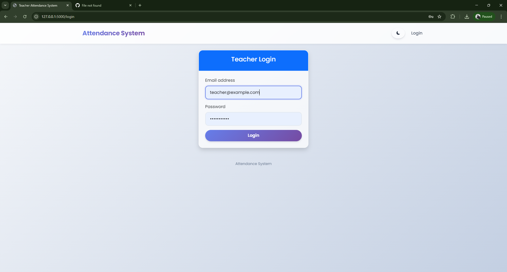
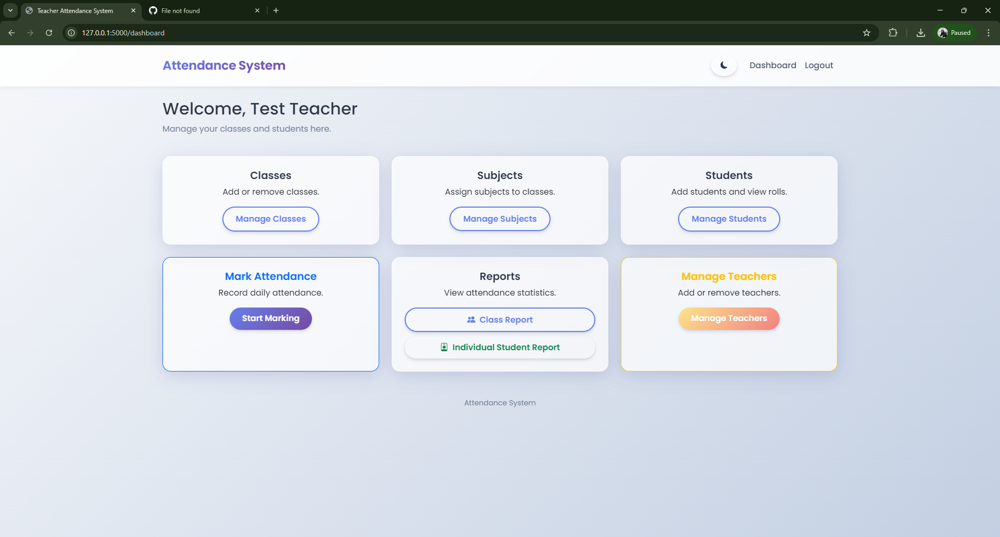
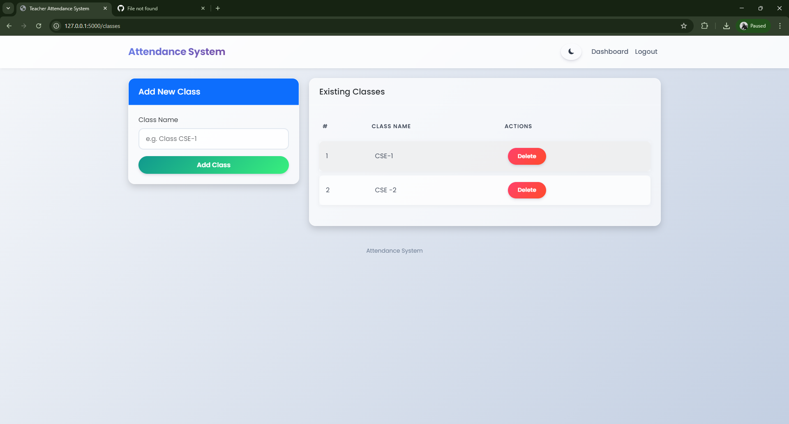
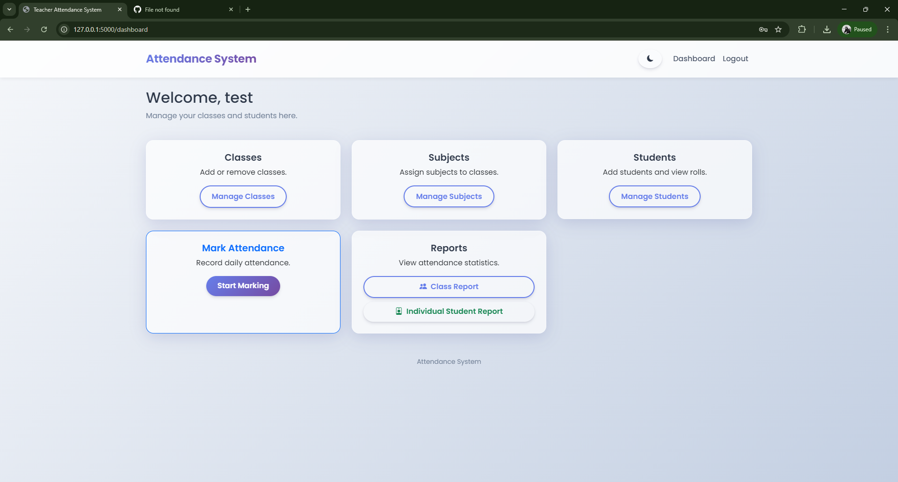
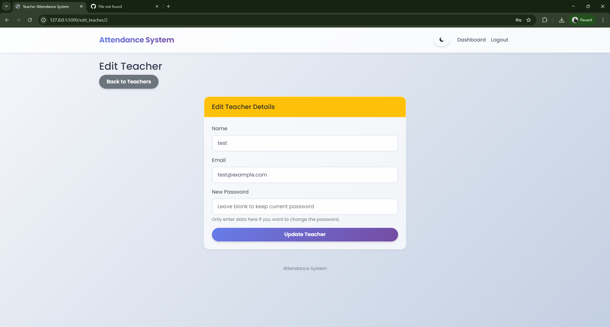
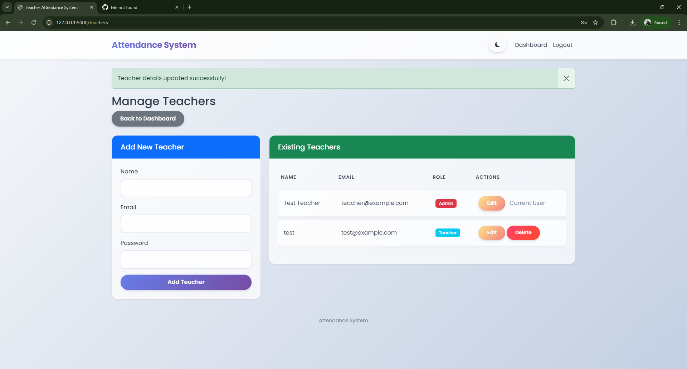
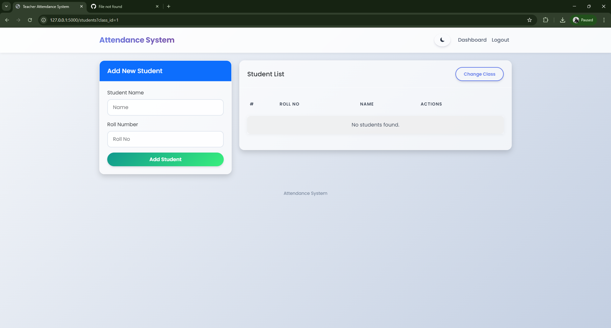
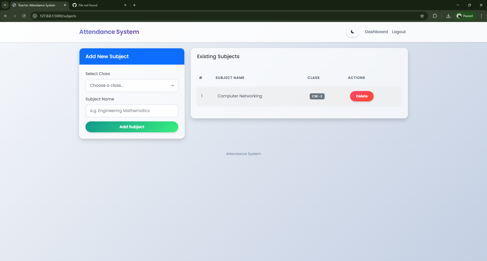

# Attendance Management System

A web-based application built with Flask for managing student attendance, classes, subjects, and teachers. This system allows teachers to mark attendance, view reports, and export attendance data to Excel.

### Screenshots













## Features

- **User Authentication**: Secure login and logout for teachers.
- **Dashboard**: Quick overview of the system.
- **Class Management**: Add and delete classes.
- **Subject Management**: Add and delete subjects assigned to specific classes.
- **Student Management**: Add, edit, and delete students, with roll number validation.
- **Search Functionality**: Search for students by name or roll number.
- **Attendance Marking**: Mark student attendance (Present/Absent) for a specific date, class, and subject.
- **Class Attendance Reports**: View detailed attendance reports for a whole class with percentage calculations.
- **Individual Student Reports**: View and export attendance reports for individual students.
- **Export to Excel**: Download class-wise and student-wise attendance reports as Excel files.
- **Teacher Management (Admin Only)**: Add, edit, and delete teacher accounts.

## Tech Stack

- **Backend**: Python, Flask
- **Database**: SQLite (via Flask-SQLAlchemy)
- **Frontend**: HTML, CSS (Bootstrap)
- **Authentication**: Flask-Login
- **Data Export**: openpyxl

## Installation

1.  **Clone the repository:**
    ```bash
    git clone https://github.com/ihsan7510/attendence_system.git
    cd attendance-system
    ```

2.  **Create a virtual environment (optional but recommended):**
    ```bash
    python -m venv venv
    # On Windows
    venv\Scripts\activate
    # On macOS/Linux
    source venv/bin/activate
    ```

3.  **Install dependencies:**
    ```bash
    pip install -r requirements.txt
    ```

4.  **Run the application:**
    ```bash
    python app.py
    ```

5.  **Access the application:**
    Open your web browser and go to `http://127.0.0.1:5000/`.

## Usage

### Default Admin Credentials
When you run the application for the first time, a default admin account is created automatically:
- **Email**: `teacher@example.com`
- **Password**: `password123`

Use these credentials to log in and start managing the system. You can add more teachers or change the password from the dashboard.

## Project Structure

- `app.py`: Main application file containing routes and logic.
- `models.py`: Database models (Teacher, Class, Subject, Student, Attendance).
- `templates/`: HTML templates for the frontend.
- `static/`: Static files (CSS, JS, Images).
- `instance/`: Contains the SQLite database (`attendance.db`).
- `requirements.txt`: List of Python dependencies.

## License

This project is open-source and available under the [MIT License](LICENSE).
